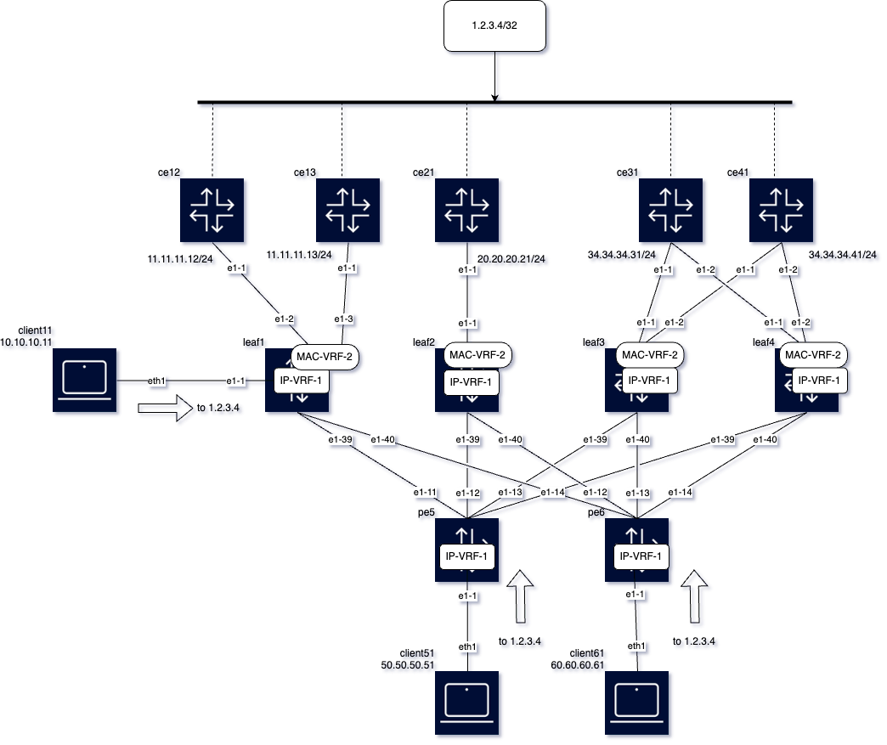

# SRL lab demonstrating Unequal ECMP, combined ECMP, IP Aliasing and resilient hashing

This lab demonstrates the following features simultaneously on SXR and DNX platforms:
- Unequal ECMP for EVPN IFL routes
- along with combined ECMP of PE-CE and EVPN IFL routes  
- along with resilient hashing
- along with IP Aliasing for EVPN IFL routes

 The lab is depicted in the following diagram:



And consists of the following nodes and types:
- leaf1, leaf3 and pe5 are SXR nodes
- leaf2, leaf4 and pe6 are SNX nodes (X3b)

All the above nodes are interconnected via LDP and SR-ISIS MPLS tunnels. All of them are running EVPN-MPLS, using pe5 and pe6 as RRs.

The nodes ce12, ce13, ce21, ce31, ce41 are 7220 D3 nodes that are acting as CE nodes running a PE-CE BGP ipv4 session to the connected leaf,
and they are all advertising the virtual IP 1.2.3.4/32 (simulated by a loopback interface address on all the CEs).

In addition client11, client51 and client61 are linux nodes that run nping tests with multiple flows.

## Configurations

leaf1 is a node running combined ECMP, unequal ECMP and also resilient hashing. Service config follows, for information about the config 
on the default network instance, please check the config/ folder.

<pre>
--{ + candidate shared default }--[ network-instance IP-VRF-1 ]--
A:leaf1# info
    type ip-vrf
    description "IP-VRF-2 EVPN-MPLS uecmp"
    ip-load-balancing {
        resilient-hash-prefix 1.2.0.0/16 {
            hash-buckets-per-path 6
            max-paths 10
        }
    }
    interface ethernet-1/1.1 {
    }
    interface irb0.1 {
    }
    interface lo0.1 {
    }
    protocols {
        bgp-evpn {
            bgp-instance 1 {
                encapsulation-type mpls
                evi 1
                ecmp 64
                mpls {
                    next-hop-resolution {
                        allowed-tunnel-types [
                            ldp
                            sr-isis
                        ]
                    }
                }
                routes {
                    route-table {
                        ip-prefix {
                            evpn-link-bandwidth {
                                advertise {
                                    weight dynamic
                                }
                                weighted-ecmp {
                                    admin-state enable
                                    max-ecmp-hash-buckets-per-next-hop-group 64
                                }
                            }
                        }
                    }
                }
            }
        }
        bgp {
            autonomous-system 64500
            router-id 1.1.1.1
            ebgp-default-policy {
                import-reject-all false
                export-reject-all false
            }
            afi-safi ipv4-unicast {
                admin-state enable
                multipath {
                    maximum-paths 64
                }
            }
            trace-options {
                flag packets {
                    modifier detail
                }
                flag update {
                    modifier detail
                }
            }
            group pe-ce {
                multihop {
                    admin-state enable
                    maximum-hops 10
                }
                afi-safi ipv4-unicast {
                    ipv4-unicast {
                        link-bandwidth {
                            add-next-hop-count-to-received-bgp-routes 1
                        }
                    }
                }
                timers {
                    connect-retry 1
                    minimum-advertisement-interval 1
                }
                trace-options {
                    flag update {
                        modifier detail
                    }
                }
                transport {
                    local-address 1.1.1.1
                }
            }
            neighbor 11.11.11.12 {
                peer-as 64512
                peer-group pe-ce
            }
            neighbor 11.11.11.13 {
                peer-as 64513
                peer-group pe-ce
            }
        }
        bgp-vpn {
            combined-ecmp {
            }
            bgp-instance 1 {
            }
        }
    }
--{ + candidate shared default }--[ network-instance IP-VRF-1 ]--
A:leaf1# /network-instance MAC-VRF-2
--{ + candidate shared default }--[ network-instance MAC-VRF-2 ]--
A:leaf1# info
    type mac-vrf
    description "MAC-VRF-2 EVPN-MPLS"
    interface ethernet-1/2.2 {
    }
    interface ethernet-1/3.2 {
    }
    interface irb0.1 {
    }
</pre>

The config on leaf2 is similar to leaf1. On leaf3 and leaf4, layer 2 and layer 3 Ethernet Segments are configured as follows:

<pre>
A:leaf3#
--{ candidate shared default }--[ network-instance IP-VRF-1 ]--
A:leaf3# info
    type ip-vrf
    description "IP-VRF-1 EVPN-MPLS uecmp"
    ip-load-balancing {
        resilient-hash-prefix 1.2.0.0/16 {
            hash-buckets-per-path 6
            max-paths 10
        }
    }
    interface irb0.1 {
    }
    interface lo0.1 {
    }
    protocols {
        bgp-evpn {
            bgp-instance 1 {
                encapsulation-type mpls
                evi 1
                ecmp 64
                mpls {
                    next-hop-resolution {
                        allowed-tunnel-types [
                            ldp
                            sr-isis
                        ]
                    }
                }
                routes {
                    route-table {
                        ip-prefix {
                            evpn-link-bandwidth {
                                advertise {
                                    weight dynamic
                                }
                                weighted-ecmp {
                                    admin-state enable
                                    max-ecmp-hash-buckets-per-next-hop-group 64
                                }
                            }
                        }
                    }
                }
            }
        }
        bgp {
            autonomous-system 64500
            router-id 3.3.3.3
            ebgp-default-policy {
                import-reject-all false
                export-reject-all false
            }
            afi-safi ipv4-unicast {
                admin-state enable
                multipath {
                    maximum-paths 64
                }
            }
            trace-options {
                flag packets {
                    modifier detail
                }
                flag update {
                    modifier detail
                }
            }
            group pe-ce {
                multihop {
                    admin-state enable
                    maximum-hops 10
                }
                afi-safi ipv4-unicast {
                    ipv4-unicast {
                        link-bandwidth {
                            add-next-hop-count-to-received-bgp-routes 1
                        }
                    }
                }
                timers {
                    connect-retry 1
                    minimum-advertisement-interval 1
                }
                trace-options {
                    flag update {
                        modifier detail
                    }
                }
                transport {
                    local-address 3.3.3.3
                }
            }
            neighbor 34.34.34.31 {
                peer-as 64531
                peer-group pe-ce
            }
            neighbor 34.34.34.41 {
                peer-as 64541
                peer-group pe-ce
            }
        }
        bgp-vpn {
            bgp-instance 1 {
            }
        }
    }
--{ candidate shared default }--[ network-instance IP-VRF-1 ]--
A:leaf3# /network-instance MAC-VRF-2
--{ candidate shared default }--[ network-instance MAC-VRF-2 ]--
A:leaf3# info
    type mac-vrf
    description "MAC-VRF-2 EVPN-MPLS"
    interface ethernet-1/1.2 {
    }
    interface ethernet-1/2.2 {
    }
    interface irb0.1 {
    }
    protocols {
        bgp-evpn {
            bgp-instance 1 {
                admin-state enable
                encapsulation-type mpls
                evi 2
                ecmp 4
                mpls {
                    next-hop-resolution {
                        allowed-tunnel-types [
                            ldp
                            sr-isis
                        ]
                    }
                }
            }
        }
        bgp-vpn {
            bgp-instance 1 {
            }
        }
    }
--{ candidate shared default }--[ network-instance MAC-VRF-2 ]--
A:leaf3# /system network-instance
--{ candidate shared default }--[ system network-instance ]--
A:leaf3# info
    protocols {
        evpn {
            ethernet-segments {
                bgp-instance 1 {
                    ethernet-segment ES-ce31 {
                        admin-state enable
                        esi 01:31:00:00:00:00:00:00:00:00
                        interface ethernet-1/1 {
                        }
                    }
                    ethernet-segment ES-ce41 {
                        admin-state enable
                        esi 01:41:00:00:00:00:00:00:00:00
                        interface ethernet-1/2 {
                        }
                    }
                    ethernet-segment L3-ES-ce31 {
                        type virtual
                        admin-state enable
                        esi 01:34:34:34:31:00:00:00:00:00
                        next-hop 34.34.34.31 {
                            evi 1 {
                            }
                        }
                    }
                    ethernet-segment L3-ES-ce41 {
                        type virtual
                        admin-state enable
                        esi 01:34:34:34:41:00:00:00:00:00
                        next-hop 34.34.34.41 {
                            evi 1 {
                            }
                        }
                    }
                }
            }
        }
        bgp-vpn {
            bgp-instance 1 {
            }
        }
    }
--{ candidate shared default }--[ system network-instance ]--
</pre>

The config on leaf4 is similar to leaf3, only that no bgp sessions to leaf3 are configured since leaf4 will forward traffic to the CEs
for prefix 1.2.3.4/32 due to IP Aliasing.

<pre>
A:leaf4#
--{ +* candidate shared default }--[ network-instance IP-VRF-1 ]--
A:leaf4# info
    type ip-vrf
    admin-state enable
    description "IP-VRF-1 EVPN-MPLS uecmp"
    ip-load-balancing {
        resilient-hash-prefix 1.2.0.0/16 {
            hash-buckets-per-path 6
            max-paths 10
        }
    }
    interface irb0.1 {
    }
    interface lo0.1 {
    }
    protocols {
        bgp-evpn {
            bgp-instance 1 {
                encapsulation-type mpls
                evi 1
                ecmp 64
                mpls {
                    next-hop-resolution {
                        allowed-tunnel-types [
                            ldp
                            sr-isis
                        ]
                    }
                }
                routes {
                    route-table {
                        ip-prefix {
                            evpn-link-bandwidth {
                                advertise {
                                    weight dynamic
                                }
                                weighted-ecmp {
                                    admin-state enable
                                    max-ecmp-hash-buckets-per-next-hop-group 64
                                }
                            }
                        }
                    }
                }
            }
        }
        bgp-vpn {
            bgp-instance 1 {
            }
        }
    }
--{ +* candidate shared default }--[ network-instance IP-VRF-1 ]--
A:leaf4# /network-instance MAC-VRF-2
--{ +* candidate shared default }--[ network-instance MAC-VRF-2 ]--
A:leaf4# info
    type mac-vrf
    description "MAC-VRF-2 EVPN-MPLS"
    interface ethernet-1/1.2 {
    }
    interface ethernet-1/2.2 {
    }
    interface irb0.1 {
    }
    protocols {
        bgp-evpn {
            bgp-instance 1 {
                admin-state enable
                encapsulation-type mpls
                evi 2
                ecmp 4
                mpls {
                    next-hop-resolution {
                        allowed-tunnel-types [
                            ldp
                            sr-isis
                        ]
                    }
                }
            }
        }
        bgp-vpn {
            bgp-instance 1 {
            }
        }
    }
--{ +* candidate shared default }--[ network-instance MAC-VRF-2 ]--
A:leaf4# /system network-instance
--{ +* candidate shared default }--[ system network-instance ]--
A:leaf4# info
    protocols {
        evpn {
            ethernet-segments {
                bgp-instance 1 {
                    ethernet-segment ES-ce31 {
                        admin-state enable
                        esi 01:31:00:00:00:00:00:00:00:00
                        interface ethernet-1/1 {
                        }
                    }
                    ethernet-segment ES-ce41 {
                        admin-state enable
                        esi 01:41:00:00:00:00:00:00:00:00
                        interface ethernet-1/2 {
                        }
                    }
                    ethernet-segment L3-ES-ce31 {
                        type virtual
                        admin-state enable
                        esi 01:34:34:34:31:00:00:00:00:00
                        next-hop 34.34.34.31 {
                            evi 1 {
                            }
                        }
                    }
                    ethernet-segment L3-ES-ce41 {
                        type virtual
                        admin-state enable
                        esi 01:34:34:34:41:00:00:00:00:00
                        next-hop 34.34.34.41 {
                            evi 1 {
                            }
                        }
                    }
                }
            }
        }
        bgp-vpn {
            bgp-instance 1 {
            }
        }
    }
</pre>

The PE nodes are configured on the same way, only use to apply weighted ecmp for traffic to 1.2.3.4/32.

<pre>
--{ candidate shared default }--[ network-instance IP-VRF-1 ]--
A:pe5# info
    type ip-vrf
    description "IP-VRF-1 EVPN-MPLS uecmp"
    ip-load-balancing {
        resilient-hash-prefix 1.2.0.0/16 {
            hash-buckets-per-path 6
            max-paths 10
        }
    }
    interface ethernet-1/1.1 {
    }
    interface irb0.1 {
    }
    interface lo0.1 {
    }
    protocols {
        bgp-evpn {
            bgp-instance 1 {
                encapsulation-type mpls
                evi 1
                ecmp 64
                mpls {
                    next-hop-resolution {
                        allowed-tunnel-types [
                            ldp
                            sr-isis
                        ]
                    }
                }
                routes {
                    route-table {
                        ip-prefix {
                            evpn-link-bandwidth {
                                advertise {
                                    weight dynamic
                                }
                                weighted-ecmp {
                                    admin-state enable
                                    max-ecmp-hash-buckets-per-next-hop-group 64
                                }
                            }
                        }
                    }
                }
            }
        }
        bgp-vpn {
            bgp-instance 1 {
            }
        }
    }
</pre>

## Control Plane checks

All the ce nodes advertise 1.2.3.4/32 to its connected leaf, with ce31 and ce41 advertising it to leaf3 and not leaf4.
The following show commands demonstrate that 1.2.3.4/32 is advertised and programmed by all nodes.

```bash

--{ + candidate shared default }--[ network-instance IP-VRF-1 ]--
A:leaf1# show route-table ipv4-unicast prefix 1.2*
---------------------------------------------------------------------------------------------------------------------------------------------------------------------------------------------------------------------------------------------------------------------------
IPv4 unicast route table of network instance IP-VRF-1
---------------------------------------------------------------------------------------------------------------------------------------------------------------------------------------------------------------------------------------------------------------------------
+-----------------------------------------+-------+------------+----------------------+----------+----------+---------+------------+-------------------------+-------------------------+-------------------------+--------------------------------------------------------+
|                 Prefix                  |  ID   | Route Type |     Route Owner      |  Active  |  Origin  | Metric  |    Pref    |     Next-hop (Type)     |   Next-hop Interface    | Backup Next-hop (Type)  |               Backup Next-hop Interface                |
|                                         |       |            |                      |          | Network  |         |            |                         |                         |                         |                                                        |
|                                         |       |            |                      |          | Instance |         |            |                         |                         |                         |                                                        |
+=========================================+=======+============+======================+==========+==========+=========+============+=========================+=========================+=========================+========================================================+
| 1.2.3.4/32                              | 0     | bgp        | bgp_mgr              | True     | IP-VRF-1 | 0       | 170        | 11.11.11.0/24           | irb0.1                  |                         |                                                        |
|                                         |       |            |                      |          |          |         |            | (indirect/local)        | irb0.1                  |                         |                                                        |
|                                         |       |            |                      |          |          |         |            | 11.11.11.0/24           |                         |                         |                                                        |
|                                         |       |            |                      |          |          |         |            | (indirect/local)        |                         |                         |                                                        |
|                                         |       |            |                      |          |          |         |            | 100.0.0.2/32            |                         |                         |                                                        |
|                                         |       |            |                      |          |          |         |            | (indirect/ldp)          |                         |                         |                                                        |
|                                         |       |            |                      |          |          |         |            | 100.0.0.3/32            |                         |                         |                                                        |
|                                         |       |            |                      |          |          |         |            | (indirect/ldp)          |                         |                         |                                                        |
|                                         |       |            |                      |          |          |         |            | 100.0.0.4/32            |                         |                         |                                                        |
|                                         |       |            |                      |          |          |         |            | (indirect/ldp)          |                         |                         |                                                        |
+-----------------------------------------+-------+------------+----------------------+----------+----------+---------+------------+-------------------------+-------------------------+-------------------------+--------------------------------------------------------+
---------------------------------------------------------------------------------------------------------------------------------------------------------------------------------------------------------------------------------------------------------------------------
---------------------------------------------------------------------------------------------------------------------------------------------------------------------------------------------------------------------------------------------------------------------------
--{ + candidate shared default }--[ network-instance IP-VRF-1 ]--

--{ candidate shared default }--[ network-instance IP-VRF-1 ]--
A:leaf2# show route-table ipv4-unicast prefix 1.2*
---------------------------------------------------------------------------------------------------------------------------------------------------------------------------------------------------------------------------------------
IPv4 unicast route table of network instance IP-VRF-1
---------------------------------------------------------------------------------------------------------------------------------------------------------------------------------------------------------------------------------------
+----------------------------------+-------+------------+----------------------+----------+----------+---------+------------+---------------------+---------------------+---------------------+---------------------------------------+
|              Prefix              |  ID   | Route Type |     Route Owner      |  Active  |  Origin  | Metric  |    Pref    |   Next-hop (Type)   | Next-hop Interface  |   Backup Next-hop   |       Backup Next-hop Interface       |
|                                  |       |            |                      |          | Network  |         |            |                     |                     |       (Type)        |                                       |
|                                  |       |            |                      |          | Instance |         |            |                     |                     |                     |                                       |
+==================================+=======+============+======================+==========+==========+=========+============+=====================+=====================+=====================+=======================================+
| 1.2.3.4/32                       | 0     | bgp        | bgp_mgr              | True     | IP-VRF-1 | 0       | 170        | 20.20.20.0/24       | irb0.1              |                     |                                       |
|                                  |       |            |                      |          |          |         |            | (indirect/local)    |                     |                     |                                       |
| 1.2.3.4/32                       | 0     | bgp-evpn   | bgp_evpn_mgr         | False    | IP-VRF-1 | 20      | 170        | 20.20.20.0/24       | irb0.1              |                     |                                       |
|                                  |       |            |                      |          |          |         |            | (indirect/local)    |                     |                     |                                       |
+----------------------------------+-------+------------+----------------------+----------+----------+---------+------------+---------------------+---------------------+---------------------+---------------------------------------+
---------------------------------------------------------------------------------------------------------------------------------------------------------------------------------------------------------------------------------------
---------------------------------------------------------------------------------------------------------------------------------------------------------------------------------------------------------------------------------------
--{ candidate shared default }--[ network-instance IP-VRF-1 ]--


--{ candidate shared default }--[ network-instance IP-VRF-1 ]--
A:leaf3# show route-table ipv4-unicast prefix 1.2*
------------------------------------------------------------------------------------------------------------------------------------------------------------------------------------------------------------------------------------------------------------
IPv4 unicast route table of network instance IP-VRF-1
------------------------------------------------------------------------------------------------------------------------------------------------------------------------------------------------------------------------------------------------------------
+--------------------------------------+-------+------------+----------------------+----------+----------+---------+------------+------------------------+------------------------+------------------------+-----------------------------------------------+
|                Prefix                |  ID   | Route Type |     Route Owner      |  Active  |  Origin  | Metric  |    Pref    |    Next-hop (Type)     |   Next-hop Interface   | Backup Next-hop (Type) |           Backup Next-hop Interface           |
|                                      |       |            |                      |          | Network  |         |            |                        |                        |                        |                                               |
|                                      |       |            |                      |          | Instance |         |            |                        |                        |                        |                                               |
+======================================+=======+============+======================+==========+==========+=========+============+========================+========================+========================+===============================================+
| 1.2.3.4/32                           | 0     | bgp        | bgp_mgr              | True     | IP-VRF-1 | 0       | 170        | 34.34.34.0/24          | irb0.1                 |                        |                                               |
|                                      |       |            |                      |          |          |         |            | (indirect/local)       | irb0.1                 |                        |                                               |
|                                      |       |            |                      |          |          |         |            | 34.34.34.0/24          |                        |                        |                                               |
|                                      |       |            |                      |          |          |         |            | (indirect/local)       |                        |                        |                                               |
| 1.2.3.4/32                           | 0     | bgp-evpn   | bgp_evpn_mgr         | False    | IP-VRF-1 | 20      | 170        | 34.34.34.0/24          | irb0.1                 |                        |                                               |
|                                      |       |            |                      |          |          |         |            | (indirect/local)       | irb0.1                 |                        |                                               |
|                                      |       |            |                      |          |          |         |            | 34.34.34.0/24          |                        |                        |                                               |
|                                      |       |            |                      |          |          |         |            | (indirect/local)       |                        |                        |                                               |
+--------------------------------------+-------+------------+----------------------+----------+----------+---------+------------+------------------------+------------------------+------------------------+-----------------------------------------------+
------------------------------------------------------------------------------------------------------------------------------------------------------------------------------------------------------------------------------------------------------------
------------------------------------------------------------------------------------------------------------------------------------------------------------------------------------------------------------------------------------------------------------
--{ candidate shared default }--[ network-instance IP-VRF-1 ]--


A:leaf4# show route-table ipv4-unicast prefix 1.2*
---------------------------------------------------------------------------------------------------------------------------------------------------------------------------------------------------------------------------------------------------------------------------------------------------
IPv4 unicast route table of network instance IP-VRF-1
---------------------------------------------------------------------------------------------------------------------------------------------------------------------------------------------------------------------------------------------------------------------------------------------------
+----------------------------------------------+-------+------------+----------------------+----------+----------+---------+------------+----------------------------+----------------------------+----------------------------+------------------------------------------------------------------+
|                    Prefix                    |  ID   | Route Type |     Route Owner      |  Active  |  Origin  | Metric  |    Pref    |      Next-hop (Type)       |     Next-hop Interface     |   Backup Next-hop (Type)   |                    Backup Next-hop Interface                     |
|                                              |       |            |                      |          | Network  |         |            |                            |                            |                            |                                                                  |
|                                              |       |            |                      |          | Instance |         |            |                            |                            |                            |                                                                  |
+==============================================+=======+============+======================+==========+==========+=========+============+============================+============================+============================+==================================================================+
| 1.2.3.4/32                                   | 0     | bgp-evpn   | bgp_evpn_mgr         | True     | IP-VRF-1 | 20      | 170        | 100.0.0.1/32               |                            |                            |                                                                  |
|                                              |       |            |                      |          |          |         |            | (indirect/ldp)             |                            |                            |                                                                  |
|                                              |       |            |                      |          |          |         |            | 100.0.0.2/32               | irb0.1                     |                            |                                                                  |
|                                              |       |            |                      |          |          |         |            | (indirect/ldp)             |                            |                            |                                                                  |
|                                              |       |            |                      |          |          |         |            | 34.34.34.0/24              |                            |                            |                                                                  |
|                                              |       |            |                      |          |          |         |            | (indirect/local)           |                            |                            |                                                                  |
+----------------------------------------------+-------+------------+----------------------+----------+----------+---------+------------+----------------------------+----------------------------+----------------------------+------------------------------------------------------------------+
---------------------------------------------------------------------------------------------------------------------------------------------------------------------------------------------------------------------------------------------------------------------------------------------------
---------------------------------------------------------------------------------------------------------------------------------------------------------------------------------------------------------------------------------------------------------------------------------------------------
--{ +* candidate shared default }--[ network-instance IP-VRF-1 ]--

--{ candidate shared default }--[ network-instance IP-VRF-1 ]--
A:pe5# show route-table ipv4-unicast prefix 1.2*
-----------------------------------------------------------------------------------------------------------------------------------------------------------------------------------------------------
IPv4 unicast route table of network instance IP-VRF-1
-----------------------------------------------------------------------------------------------------------------------------------------------------------------------------------------------------
+---------------------------+-------+------------+----------------------+----------+----------+---------+------------+-----------------+-----------------+-----------------+------------------------+
|          Prefix           |  ID   | Route Type |     Route Owner      |  Active  |  Origin  | Metric  |    Pref    | Next-hop (Type) |    Next-hop     | Backup Next-hop |    Backup Next-hop     |
|                           |       |            |                      |          | Network  |         |            |                 |    Interface    |     (Type)      |       Interface        |
|                           |       |            |                      |          | Instance |         |            |                 |                 |                 |                        |
+===========================+=======+============+======================+==========+==========+=========+============+=================+=================+=================+========================+
| 1.2.3.4/32                | 0     | bgp-evpn   | bgp_evpn_mgr         | True     | IP-VRF-1 | 10      | 170        | 100.0.0.1/32    |                 |                 |                        |
|                           |       |            |                      |          |          |         |            | (indirect/ldp)  |                 |                 |                        |
|                           |       |            |                      |          |          |         |            | 100.0.0.2/32    |                 |                 |                        |
|                           |       |            |                      |          |          |         |            | (indirect/ldp)  |                 |                 |                        |
|                           |       |            |                      |          |          |         |            | 100.0.0.3/32    |                 |                 |                        |
|                           |       |            |                      |          |          |         |            | (indirect/ldp)  |                 |                 |                        |
|                           |       |            |                      |          |          |         |            | 100.0.0.4/32    |                 |                 |                        |
|                           |       |            |                      |          |          |         |            | (indirect/ldp)  |                 |                 |                        |
+---------------------------+-------+------------+----------------------+----------+----------+---------+------------+-----------------+-----------------+-----------------+------------------------+
-----------------------------------------------------------------------------------------------------------------------------------------------------------------------------------------------------
-----------------------------------------------------------------------------------------------------------------------------------------------------------------------------------------------------
--{ candidate shared default }--[ network-instance IP-VRF-1 ]--

```
Note that while all the leaf nodes show a bgp and an evpn-ifl route for 1.2.3.4/32, leaf1 shows only one route with the combined next hops of the PE-CE 
and the EVPN IFL routes. This is due to the configuration of `combined-ecmp` on leaf1. The reason why `combined-ecmp` is only configured on leaf1 and not
the other leaf nodes is to prevent loops in the current release, since there is nothing that prevents an evpn packet from being routed back to evpn.

Some more details about how the prefix is programmed in leaf one follows.

```bash
--{ + candidate shared default }--[ network-instance IP-VRF-1 ]--
A:leaf1# show route-table ipv4-unicast prefix 1.2*
---------------------------------------------------------------------------------------------------------------------------------------------------------------------------------------------------------------------------------------------------------------------------
IPv4 unicast route table of network instance IP-VRF-1
---------------------------------------------------------------------------------------------------------------------------------------------------------------------------------------------------------------------------------------------------------------------------
+-----------------------------------------+-------+------------+----------------------+----------+----------+---------+------------+-------------------------+-------------------------+-------------------------+--------------------------------------------------------+
|                 Prefix                  |  ID   | Route Type |     Route Owner      |  Active  |  Origin  | Metric  |    Pref    |     Next-hop (Type)     |   Next-hop Interface    | Backup Next-hop (Type)  |               Backup Next-hop Interface                |
|                                         |       |            |                      |          | Network  |         |            |                         |                         |                         |                                                        |
|                                         |       |            |                      |          | Instance |         |            |                         |                         |                         |                                                        |
+=========================================+=======+============+======================+==========+==========+=========+============+=========================+=========================+=========================+========================================================+
| 1.2.3.4/32                              | 0     | bgp        | bgp_mgr              | True     | IP-VRF-1 | 0       | 170        | 11.11.11.0/24           | irb0.1                  |                         |                                                        |
|                                         |       |            |                      |          |          |         |            | (indirect/local)        | irb0.1                  |                         |                                                        |
|                                         |       |            |                      |          |          |         |            | 11.11.11.0/24           |                         |                         |                                                        |
|                                         |       |            |                      |          |          |         |            | (indirect/local)        |                         |                         |                                                        |
|                                         |       |            |                      |          |          |         |            | 100.0.0.2/32            |                         |                         |                                                        |
|                                         |       |            |                      |          |          |         |            | (indirect/ldp)          |                         |                         |                                                        |
|                                         |       |            |                      |          |          |         |            | 100.0.0.3/32            |                         |                         |                                                        |
|                                         |       |            |                      |          |          |         |            | (indirect/ldp)          |                         |                         |                                                        |
|                                         |       |            |                      |          |          |         |            | 100.0.0.4/32            |                         |                         |                                                        |
|                                         |       |            |                      |          |          |         |            | (indirect/ldp)          |                         |                         |                                                        |
+-----------------------------------------+-------+------------+----------------------+----------+----------+---------+------------+-------------------------+-------------------------+-------------------------+--------------------------------------------------------+
---------------------------------------------------------------------------------------------------------------------------------------------------------------------------------------------------------------------------------------------------------------------------
---------------------------------------------------------------------------------------------------------------------------------------------------------------------------------------------------------------------------------------------------------------------------
--{ + candidate shared default }--[ network-instance IP-VRF-1 ]--
A:leaf1#
--{ + candidate shared default }--[ network-instance IP-VRF-1 ]--
A:leaf1# show route-table ipv4-unicast prefix 1.2*  detail
--------------------------------------------------------------------------------------------------------------------------------------------------------------------------------------------------------------------------------------------------------------------------------
IPv4 unicast route table of network instance IP-VRF-1
--------------------------------------------------------------------------------------------------------------------------------------------------------------------------------------------------------------------------------------------------------------------------------
Destination            : 1.2.3.4/32
ID                     : 0
Route Type             : bgp
Route Owner            : bgp_mgr
Origin Network Instance: IP-VRF-1
Metric                 : 0
Preference             : 170
Active                 : true
Last change            : 2024-06-14T10:32:04.169Z
Resilient hash         : true
--------------------------------------------------------------------------------------------------------------------------------------------------------------------------------------------------------------------------------------------------------------------------------
Next hops: 5 entries
11.11.11.12 (indirect) resolved by route to 11.11.11.0/24 (local)
via 11.11.11.254 (direct) via [irb0.1] with ECMP weight 1
11.11.11.13 (indirect) resolved by route to 11.11.11.0/24 (local)
via 11.11.11.254 (direct) via [irb0.1] with ECMP weight 1
100.0.0.2 (indirect) resolved by tunnel to 100.0.0.2/32 (ldp) with ECMP weight 1
100.0.0.3 (indirect) resolved by tunnel to 100.0.0.3/32 (ldp) with ECMP weight 1
100.0.0.4 (indirect) resolved by tunnel to 100.0.0.4/32 (ldp) with ECMP weight 1
Backup Next hops: 0 entries

--------------------------------------------------------------------------------------------------------------------------------------------------------------------------------------------------------------------------------------------------------------------------------
--------------------------------------------------------------------------------------------------------------------------------------------------------------------------------------------------------------------------------------------------------------------------------
Route Programming Status
--------------------------------------------------------------------------------------------------------------------------------------------------------------------------------------------------------------------------------------------------------------------------------
Suppressed                        : false
Last successful FIB operation     : modify
Last successful FIB operation time: 2024-06-14T10:32:04.172Z
Current FIB operation pending     : none
Last failed FIB operation         : none
--------------------------------------------------------------------------------------------------------------------------------------------------------------------------------------------------------------------------------------------------------------------------------
Primary NHG
--------------------------------------------------------------------------------------------------------------------------------------------------------------------------------------------------------------------------------------------------------------------------------
--------------------------------------------------------------------------------------------------------------------------------------------------------------------------------------------------------------------------------------------------------------------------------
Backup NHG
--------------------------------------------------------------------------------------------------------------------------------------------------------------------------------------------------------------------------------------------------------------------------------
--{ + candidate shared default }--[ network-instance IP-VRF-1 ]--
```
### Unequal ECMP and IP Aliasing interaction

Note that weights are also received on the EVPN IFL routes. It is interesting to note that leaf4 does not advertise an EVPN IFL route for 1.2.3.4/32, and only
leaf3 does it, with a weight of 2:

```bash
--{ + candidate shared default }--[ network-instance default ]--
A:leaf1# show protocols bgp routes evpn route-type 5 prefix 1.2.3.4/32 rd 100.0.0.3:1 neighbor 100.0.0.5 detail
--------------------------------------------------------------------------------------------------------------------------------------------------------------------------------------------------------------------------------------------------------------------------------
Show report for the EVPN routes in network-instance  "default"
--------------------------------------------------------------------------------------------------------------------------------------------------------------------------------------------------------------------------------------------------------------------------------
Route Distinguisher: 100.0.0.3:1
Tag-ID             : 0
ip-prefix-len      : 32
ip-prefix          : 1.2.3.4/32
neighbor           : 100.0.0.5
Gateway IP         : 0.0.0.0
Received paths     : 1
  Path 1: <Best,Valid,Used,>
    ESI               : 01:34:34:34:31:00:00:00:00:00
    Label             : 1002
    Route source      : neighbor 100.0.0.5 (last modified 1h36m15s ago)
    Route preference  : No MED, LocalPref is 100
    Atomic Aggr       : false
    BGP next-hop      : 100.0.0.3
    AS Path           :  i [64531]
    Communities       : [target:64500:1, evpn-bandwidth:1:2, bgp-tunnel-encap:MPLS]
    RR Attributes     : Originator-ID 100.0.0.3, Cluster-List is [5.5.5.5]
    Aggregation       : None
    Unknown Attr      : None
    Invalid Reason    : None
    Tie Break Reason  : none
    Route Flap Damping: None
--------------------------------------------------------------------------------------------------------------------------------------------------------------------------------------------------------------------------------------------------------------------------------
--{ + candidate shared default }--[ network-instance default ]--
```
However, the weight is divided between leaf3 and leaf4 because of the received AD per EVI routes for the same ESI from both leaf3 and leaf4:

```bash
--{ + candidate shared default }--[ network-instance default ]--
A:leaf1# show protocols bgp routes evpn route-type 1 esi 01:34:34:34:31:00:00:00:00:00 neighbor 100.0.0.5 ethernet-tag-id 0 detail
--------------------------------------------------------------------------------------------------------------------------------------------------------------------------------------------------------------------------------------------------------------------------------
Show report for the EVPN routes in network-instance  "default"
--------------------------------------------------------------------------------------------------------------------------------------------------------------------------------------------------------------------------------------------------------------------------------
Route Distinguisher: 100.0.0.3:1
Tag-ID             : 0
ESI                : 01:34:34:34:31:00:00:00:00:00
neighbor           : 100.0.0.5
Received paths     : 1
  Path 1: <Best,Valid,Used,>
    ESI               : 01:34:34:34:31:00:00:00:00:00
    Label             : 1002
    Route source      : neighbor 100.0.0.5 (last modified 1h40m28s ago)
    Route preference  : No MED, LocalPref is 100
    Atomic Aggr       : false
    BGP next-hop      : 100.0.0.3
    AS Path           :  i
    Communities       : [target:64500:1, l2-attribute:MTU: 0 V: 0 M: 0 F: 0 C: 0 P: 1 B: 0, bgp-tunnel-encap:MPLS]
    RR Attributes     : Originator-ID 100.0.0.3, Cluster-List is [5.5.5.5]
    Aggregation       : None
    Unknown Attr      : None
    Invalid Reason    : None
    Tie Break Reason  : none
    Route Flap Damping: None
--------------------------------------------------------------------------------------------------------------------------------------------------------------------------------------------------------------------------------------------------------------------------------
Route Distinguisher: 100.0.0.4:1
Tag-ID             : 0
ESI                : 01:34:34:34:31:00:00:00:00:00
neighbor           : 100.0.0.5
Received paths     : 1
  Path 1: <Best,Valid,Used,>
    ESI               : 01:34:34:34:31:00:00:00:00:00
    Label             : 1000
    Route source      : neighbor 100.0.0.5 (last modified 1h39m33s ago)
    Route preference  : No MED, LocalPref is 100
    Atomic Aggr       : false
    BGP next-hop      : 100.0.0.4
    AS Path           :  i
    Communities       : [target:64500:1, l2-attribute:MTU: 0 V: 0 M: 0 F: 0 C: 0 P: 1 B: 0, bgp-tunnel-encap:MPLS]
    RR Attributes     : Originator-ID 100.0.0.4, Cluster-List is [5.5.5.5]
    Aggregation       : None
    Unknown Attr      : None
    Invalid Reason    : None
    Tie Break Reason  : none
    Route Flap Damping: None
--------------------------------------------------------------------------------------------------------------------------------------------------------------------------------------------------------------------------------------------------------------------------------
--{ + candidate shared default }--[ network-instance default ]--
```

### Combined ECMP, weights and resilient hashing state

More info about the combined ecmp next hops follows:

```bash
--{ + candidate shared default }--[  ]--
A:leaf1# info from state network-instance IP-VRF-1 route-table ipv4-unicast route 1.2.3.4/32 id 0 route-type bgp route-owner bgp_mgr origin-network-instance IP-VRF-1
    network-instance IP-VRF-1 {
        route-table {
            ipv4-unicast {
                route 1.2.3.4/32 id 0 route-type bgp route-owner bgp_mgr origin-network-instance IP-VRF-1 {
                    leakable false
                    metric 0
                    preference 170
                    active true
                    last-app-update "2024-06-14T10:32:04.169Z (37 minutes ago)"
                    next-hop-group 183856865056
                    next-hop-group-network-instance IP-VRF-1
                    resilient-hash true
                    fib-programming {
                        suppressed false
                        last-successful-operation-type modify
                        last-successful-operation-timestamp "2024-06-14T10:32:04.172Z (37 minutes ago)"
                        pending-operation-type none
                        last-failed-operation-type none
                    }
                }
            }
        }
    }
--{ + candidate shared default }--[  ]--
A:leaf1# info from state network-instance IP-VRF-1 route-table next-hop-group 183856865056
    network-instance IP-VRF-1 {
        route-table {
            next-hop-group 183856865056 {
                backup-next-hop-group 0
                fib-programming {
                    last-successful-operation-type modify
                    last-successful-operation-timestamp "2024-06-14T10:32:04.172Z (38 minutes ago)"
                    pending-operation-type none
                    last-failed-operation-type none
                }
                next-hop 0 {
                    next-hop 183856865033
                    weight 1
                    resolved true
                }
                next-hop 1 {
                    next-hop 183856865034
                    weight 1
                    resolved true
                }
                next-hop 2 {
                    next-hop 183856865049
                    weight 1
                    resolved true
                }
                next-hop 3 {
                    next-hop 183856865050
                    weight 1
                    resolved true
                }
                next-hop 4 {
                    next-hop 183856865051
                    weight 1
                    resolved true
                }
            }
        }
    }
--{ + candidate shared default }--[  ]--
A:leaf1# info from state network-instance IP-VRF-1 route-table next-hop {183856865033,183856865034,183856865049,183856865050,183856865051}
    network-instance IP-VRF-1 {
        route-table {
            next-hop 183856865033 {
                type indirect
                ip-address 11.11.11.12
                resolving-route {
                    ip-prefix 11.11.11.0/24
                    route-type local
                    route-owner net_inst_mgr
                }
            }
            next-hop 183856865034 {
                type indirect
                ip-address 11.11.11.13
                resolving-route {
                    ip-prefix 11.11.11.0/24
                    route-type local
                    route-owner net_inst_mgr
                }
            }
            next-hop 183856865049 {
                type indirect
                ip-address 100.0.0.2
                resolving-tunnel {
                    ip-prefix 100.0.0.2/32
                    tunnel-type ldp
                    tunnel-owner ldp_mgr
                }
            }
            next-hop 183856865050 {
                type indirect
                ip-address 100.0.0.3
                resolving-tunnel {
                    ip-prefix 100.0.0.3/32
                    tunnel-type ldp
                    tunnel-owner ldp_mgr
                }
            }
            next-hop 183856865051 {
                type indirect
                ip-address 100.0.0.4
                resolving-tunnel {
                    ip-prefix 100.0.0.4/32
                    tunnel-type ldp
                    tunnel-owner ldp_mgr
                }
            }
        }
    }
```
The programmed next hops can also be checked on the FIB:

```bash
A:leaf1# info from state platform linecard 1 forwarding-complex 0 fib-table next-hop-group 183856865056
    platform {
        linecard 1 {
            forwarding-complex 0 {
                fib-table {
                    next-hop-group 183856865056 {
                        oper-state up
                        backup-next-hop-group 0
                        backup-active false
                        next-hop 0 {
                            next-hop 183856865033
                            oper-state up
                        }
                        next-hop 1 {
                            next-hop 183856865034
                            oper-state up
                        }
                        next-hop 2 {
                            next-hop 183856865049
                            oper-state up
                        }
                        next-hop 3 {
                            next-hop 183856865050
                            oper-state up
                        }
                        next-hop 4 {
                            next-hop 183856865051
                            oper-state up
                        }
                    }
                }
            }
        }
    }
```
The FIB information does not show the weight information, or the normalized weights that will be used. For that, a shell command must be used.

```bash
xdp_lc_1_0> XdpIp::DumpNexthopGroups 183856865056 1
NexthopGroup - num=59
[NexthopGroup 183856865056 Index 59]
    failed_                                                           No
    Layer2                                                            No
    l2_mcast_enabled_                                                 No
    explicit_delete_                                                  No
    Allow Nexthop Programming                                         Yes
    extract_to_host_                                                  No
    subnet_broadcast_                                                 No
    generate_icmp_                                                    No
    black_hole_                                                       No
    nexthop_index_for_arp_                                            0
    hierarchy_level_                                                  1
    hw_index_                                                         3 (ECMP Y)
    (DGPP) lag_info                                                   id 0, size 0
    egress_nh_info_                                                   Level 0 index 0
    sticky_ecmp_                                                      Yes // -> the prefix is included in resilient hashing as per the config
      max_sticky_ecmp_paths_                                          10
      bins_per_sticky_ecmp_path_                                      6
    backup_nexthop_group_                                             0
    backup_nexthop_group_active_                                      No
    max_weighted_ecmp_buckets_                                        64
    nexthop_group_tnl_term_stat_id_                                   0
    pd_handle_                                                        (nil)
    Tunnel Terminations - num 0
    [ecmp_user:]
        ecmp_hierarchy_level_                                         1
        ecmp_base_                                                    12
        num_ecmp_entries_                                             60
        reserved_ecmp_entries_                                        60
        ecmp_alloc_retry_failed                                       0
        ecmp_user_is_cached_                                          0
        ecmp_user_is_static_                                          0
    cfg_nexthops_ - num 5
    [Nexthop]
        NexthopId:                                                    (for NHG = 183856865056) 183856865033
        weight                                                        1
        Used in Sticky ECMP:                                          Yes
    [Nexthop]
        NexthopId:                                                    (for NHG = 183856865056) 183856865034
        weight                                                        1
        Used in Sticky ECMP:                                          Yes
    [Nexthop]
        NexthopId:                                                    (for NHG = 183856865056) 183856865049
        weight                                                        1
        Used in Sticky ECMP:                                          Yes
    [Nexthop]
        NexthopId:                                                    (for NHG = 183856865056) 183856865050
        weight                                                        1
        Used in Sticky ECMP:                                          Yes
    [Nexthop]
        NexthopId:                                                    (for NHG = 183856865056) 183856865051
        weight                                                        1
        Used in Sticky ECMP:                                          Yes
    active_nexthops_ - num 60
    [Nexthop]
        NexthopId:                                                    (for NHG = 183856865056) 183856865049
        Repeat Count                                                  12 // this is the normalized weight
    [Nexthop]
        NexthopId:                                                    (for NHG = 183856865056) 183856865050
        Repeat Count                                                  12
    [Nexthop]
        NexthopId:                                                    (for NHG = 183856865056) 183856865051
        Repeat Count                                                  12
    [Nexthop]
        NexthopId:                                                    (for NHG = 183856865056) 183856865034
        Repeat Count                                                  12
    [Nexthop]
        NexthopId:                                                    (for NHG = 183856865056) 183856865033
        Repeat Count                                                  12
    Routes: num 1
      10241:1.2.3.4/32
    [Pd Object:]
        CSim NexthopGroup 59, 183856865056 Pi Index 59
            is_ecmp_nhg_ Y
            ecmp_nh_base_rec_id_ 0xc
            num_nexthops_ 60
            ecmp_set_size_ 60
            hierarchy_level_ 1
```
### Check weighted ECMP on the remote PEs

Nodes pe5 and pe6 program the prefix with the corresponding weights too:

```bash
--{ candidate shared default }--[ network-instance IP-VRF-1 ]--
A:pe5# info from state route-table ipv4-unicast route 1.2.3.4/32 id 0 route-type bgp-evpn route-owner bgp_evpn_mgr origin-network-instance IP-VRF-1
    route-table {
        ipv4-unicast {
            route 1.2.3.4/32 id 0 route-type bgp-evpn route-owner bgp_evpn_mgr origin-network-instance IP-VRF-1 {
                leakable false
                metric 10
                preference 170
                active true
                last-app-update "2024-06-14T10:32:04.177Z (49 minutes ago)"
                next-hop-group 183856781861
                next-hop-group-network-instance IP-VRF-1
                resilient-hash true
                fib-programming {
                    suppressed false
                    last-successful-operation-type modify
                    last-successful-operation-timestamp "2024-06-14T10:32:04.178Z (49 minutes ago)"
                    pending-operation-type none
                    last-failed-operation-type none
                }
            }
        }
    }
--{ candidate shared default }--[ network-instance IP-VRF-1 ]--
A:pe5# info from state route-table next-hop-group 183856781861
    route-table {
        next-hop-group 183856781861 {
            backup-next-hop-group 0
            fib-programming {
                last-successful-operation-type modify
                last-successful-operation-timestamp "2024-06-14T10:32:04.178Z (50 minutes ago)"
                pending-operation-type none
                last-failed-operation-type none
            }
            next-hop 0 {
                next-hop 183856781843
                weight 5
                resolved true
            }
            next-hop 1 {
                next-hop 183856781844
                weight 1
                resolved true
            }
            next-hop 2 {
                next-hop 183856781845
                weight 1
                resolved true
            }
            next-hop 3 {
                next-hop 183856781846
                weight 1
                resolved true
            }
        }
    }
--{ candidate shared default }--[ network-instance IP-VRF-1 ]--
A:pe5# info from state route-table next-hop {183856781843,183856781844,183856781845,183856781846}
    route-table {
        next-hop 183856781843 {
            type indirect
            ip-address 100.0.0.1
            resolving-tunnel {
                ip-prefix 100.0.0.1/32
                tunnel-type ldp
                tunnel-owner ldp_mgr
            }
            mpls {
                pushed-mpls-label-stack [
                    1000
                ]
            }
        }
        next-hop 183856781844 {
            type indirect
            ip-address 100.0.0.2
            resolving-tunnel {
                ip-prefix 100.0.0.2/32
                tunnel-type ldp
                tunnel-owner ldp_mgr
            }
            mpls {
                pushed-mpls-label-stack [
                    1000
                ]
            }
        }
        next-hop 183856781845 {
            type indirect
            ip-address 100.0.0.3
            resolving-tunnel {
                ip-prefix 100.0.0.3/32
                tunnel-type ldp
                tunnel-owner ldp_mgr
            }
            mpls {
                pushed-mpls-label-stack [
                    1002
                ]
            }
        }
        next-hop 183856781846 {
            type indirect
            ip-address 100.0.0.4
            resolving-tunnel {
                ip-prefix 100.0.0.4/32
                tunnel-type ldp
                tunnel-owner ldp_mgr
            }
            mpls {
                pushed-mpls-label-stack [
                    1000
                ]
            }
        }
    }
```
***NOTE: that there is currently an issue and the node with combined-ecmp advertises a weight of 5 (all the combined next hops) as opposed to only the CE ones***

```bash
xdp_lc_1_0> XdpIp::DumpNexthopGroups 183856781861 1
NexthopGroup - num=69
[NexthopGroup 183856781861 Index 56]
    failed_                                                           No
    Layer2                                                            No
    l2_mcast_enabled_                                                 No
    explicit_delete_                                                  No
    Allow Nexthop Programming                                         Yes
    extract_to_host_                                                  No
    subnet_broadcast_                                                 No
    generate_icmp_                                                    No
    black_hole_                                                       No
    nexthop_index_for_arp_                                            0
    hierarchy_level_                                                  1
    hw_index_                                                         1 (ECMP Y)
    (DGPP) lag_info                                                   id 0, size 0
    egress_nh_info_                                                   Level 0 index 0
    sticky_ecmp_                                                      Yes
      max_sticky_ecmp_paths_                                          10
      bins_per_sticky_ecmp_path_                                      6
    backup_nexthop_group_                                             0
    backup_nexthop_group_active_                                      No
    max_weighted_ecmp_buckets_                                        64
    nexthop_group_tnl_term_stat_id_                                   0
    pd_handle_                                                        (nil)
    Tunnel Terminations - num 0
    [ecmp_user:]
        ecmp_hierarchy_level_                                         1
        ecmp_base_                                                    22
        num_ecmp_entries_                                             60
        reserved_ecmp_entries_                                        60
        ecmp_alloc_retry_failed                                       0
        ecmp_user_is_cached_                                          0
        ecmp_user_is_static_                                          0
    cfg_nexthops_ - num 4
    [Nexthop]
        NexthopId:                                                    (for NHG = 183856781861) 183856781843
        weight                                                        5
        Used in Sticky ECMP:                                          Yes
    [Nexthop]
        NexthopId:                                                    (for NHG = 183856781861) 183856781844
        weight                                                        1
        Used in Sticky ECMP:                                          Yes
    [Nexthop]
        NexthopId:                                                    (for NHG = 183856781861) 183856781845
        weight                                                        1
        Used in Sticky ECMP:                                          Yes
    [Nexthop]
        NexthopId:                                                    (for NHG = 183856781861) 183856781846
        weight                                                        1
        Used in Sticky ECMP:                                          Yes
    active_nexthops_ - num 60
    [Nexthop]
        NexthopId:                                                    (for NHG = 183856781861) 183856781846
        Repeat Count                                                  7
    [Nexthop]
        NexthopId:                                                    (for NHG = 183856781861) 183856781845
        Repeat Count                                                  8
    [Nexthop]
        NexthopId:                                                    (for NHG = 183856781861) 183856781843
        Repeat Count                                                  38
    [Nexthop]
        NexthopId:                                                    (for NHG = 183856781861) 183856781844
        Repeat Count                                                  7
    Routes: num 1
      10241:1.2.3.4/32
    [Pd Object:]
        CSim NexthopGroup 56, 183856781861 Pi Index 56
            is_ecmp_nhg_ Y
            ecmp_nh_base_rec_id_ 0x16
            num_nexthops_ 60
            ecmp_set_size_ 60
            hierarchy_level_ 1
```

## Data Plane checks

The data plane can be checked for instance using the `nping` tool, which allows sending multiple flows with consecutive destination ports.
As an example:

`nping --udp 1.2.3.4 --source-ip 10.10.10.11 --source-port 12345 --dest-port 10000-10006 -e eth1.1 -d5 -c 1 --dest-mac 1a:6b:08:ff:00:00`

Where:
- `nping` starts the tool
- `udp` uses UDP instead of TCP
- `-c 1` sends one packet per destination port
- the `--dest-mac` command is needed to make sure the packets are routed properly

When sent from e.g., Client11:

<pre>
bash-5.0# nping --udp 1.2.3.4 --source-ip 10.10.10.11 --source-port 12345 --dest-port 10000-10006 -e eth1.1 -d5 -c 1 --dest-mac 1a:6b:08:ff:00:00
Using network interface "eth1.1"
Nping will send packets at raw ethernet level

Starting Nping 0.7.80 ( https://nmap.org/nping ) at 2024-06-14 11:32 UTC
Resolving specified targets...
Determining target 1.2.3.4 MAC address or next hop MAC address...
    > Checking system's ARP cache...
    > Success: Entry found [1a:6b:08:00:00:00]
+-----------------TARGET-----------------+
Device Name:            eth1.1
Device FullName:        eth1.1
Device Type:            Ethernet
Directly connected?:    no
Address family:         AF_INET
Resolved Hostname:
Supplied Hostname:      (null)
Target Address:         1.2.3.4
Source Address:         10.10.10.11
Spoofed Address:        10.10.10.11
Next Hop Address:       10.10.10.254
Target MAC Address:     00:00:00:00:00:00
Source MAC Address:     00:c1:ab:00:00:01
Next Hop MAC Address:   1a:6b:08:00:00:00
1 target IP address determined.
libnsock nsock_iod_new2(): nsock_iod_new (IOD #1)
BPF-filter: (not src host 10.10.10.11 and dst host 10.10.10.11) and ((udp and dst port 12345) or (icmp and (icmp[icmptype] = 3 or icmp[icmptype] = 4 or icmp[icmptype] = 5 or icmp[icmptype] = 11 or icmp[icmptype] = 12)) )
Opening pcap device eth1.1
libnsock nsock_pcap_open(): PCAP requested on device 'eth1.1' with berkeley filter '(not src host 10.10.10.11 and dst host 10.10.10.11) and ((udp and dst port 12345) or (icmp and (icmp[icmptype] = 3 or icmp[icmptype] = 4 or icmp[icmptype] = 5 or icmp[icmptype] = 11 or icmp[icmptype] = 12)) )' (promisc=1 snaplen=8192 to_ms=200) (IOD #1)
libnsock nsock_pcap_open(): PCAP created successfully on device 'eth1.1' (pcap_desc=4 bsd_hack=0 to_valid=1 l3_offset=14) (IOD #1)
Pcap device eth1.1 open successfully
Next target returned by getNextTarget(): Targets[0/1] --> 1.2.3.4

fillPacket(target=0x55ce726e4820, port=10000, buff=0x7ffc934ae579, bufflen=65535, filledlen=0x7ffc934a22f0 rawfd=-1)
libnsock nsock_pcap_read_packet(): Pcap read request from IOD #1  EID 13
libnsock nsock_pcap_read_packet(): Pcap read request from IOD #1  EID 21
libnsock nsock_timer_create(): Timer created - 1ms from now.  EID 28
libnsock nsock_trace_handler_callback(): Callback: TIMER SUCCESS for EID 28
nping_event_handler()
nping_event_handler(): Received callback of type TIMER with status SUCCESS
SENT (0.0751s) UDP [10.10.10.11:12345 > 1.2.3.4:10000 len=8 csum=0x907A] IP [ver=4 ihl=5 tos=0x00 iplen=28 id=31373 foff=0 ttl=64 proto=17 csum=0xe829]
0000   1a 6b 08 ff 00 00 00 c1  ab 00 00 01 08 00 45 00  .k............E.
0010   00 1c 7a 8d 00 00 40 11  e8 29 0a 0a 0a 0b 01 02  ..z...@..)......
0020   03 04 30 39 27 10 00 08  90 7a                    ..09'....z
Next target returned by getNextTarget(): Targets[0/1] --> 1.2.3.4

fillPacket(target=0x55ce726e4820, port=10001, buff=0x7ffc934ae579, bufflen=65535, filledlen=0x7ffc934a22f0 rawfd=-1)
libnsock nsock_pcap_read_packet(): Pcap read request from IOD #1  EID 37
libnsock nsock_pcap_read_packet(): Pcap read request from IOD #1  EID 45
libnsock nsock_timer_create(): Timer created - 1000ms from now.  EID 52
libnsock nsock_trace_handler_callback(): Callback: READ-PCAP TIMEOUT for EID 13
nping_event_handler()
nping_event_handler(): Received callback of type READ-PCAP with status TIMEOUT
nping_event_handler(): READ-PCAP timeout: Resource temporarily unavailable

libnsock nsock_trace_handler_callback(): Callback: READ-PCAP TIMEOUT for EID 21
nping_event_handler()
nping_event_handler(): Received callback of type READ-PCAP with status TIMEOUT
nping_event_handler(): READ-PCAP timeout: Resource temporarily unavailable

Next target returned by getNextTarget(): Targets[0/1] --> 1.2.3.4

----snip----
</pre>

Stats or wireshark can be used on the CEs to check who receives the packets.
